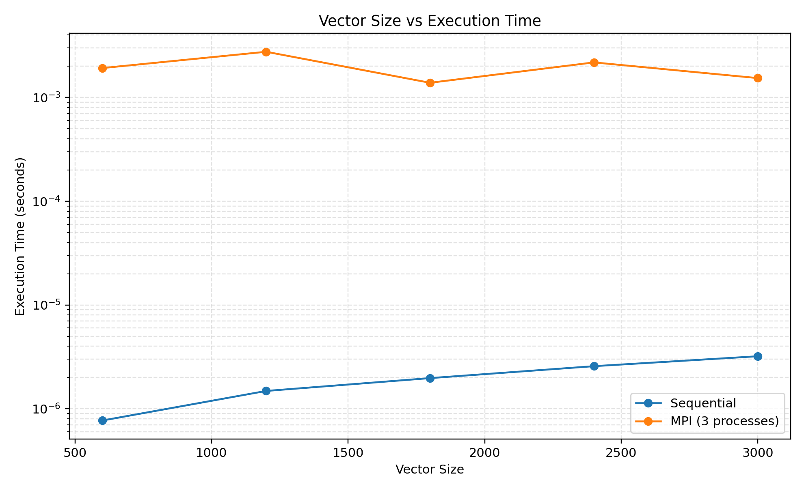
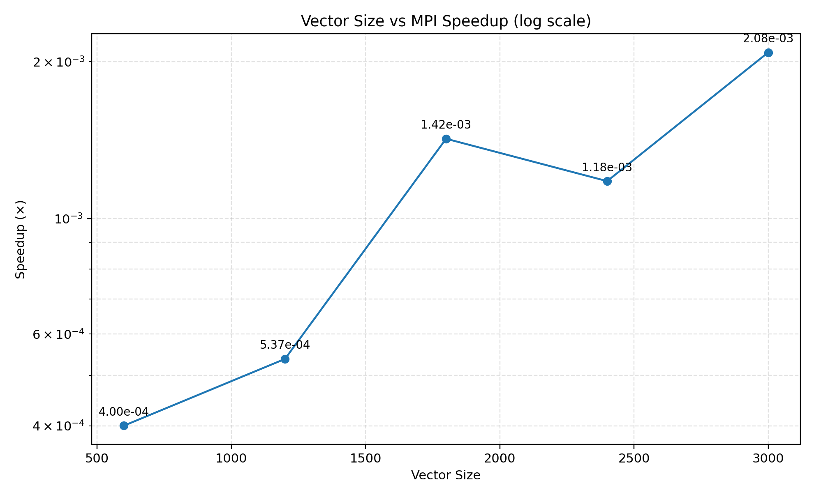
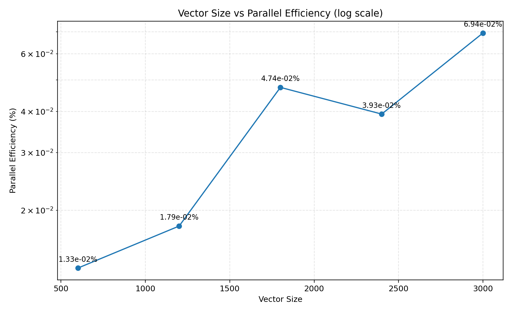

# Distributed Vector Processing using MPI

## Problem Statement

Given two vectors **A** and **B** of size **N**, calculate their dot product using:

1. Sequential processing.
2. Distributed MPI processing using **three MPI processes**.

The vectors must be divided among the processes, each process must compute the dot product of its local portion, and the partial results must be combined to obtain the final dot product. The MPI result must match the sequential result. Performance is evaluated for vector sizes **600, 1200, 1800, 2400, and 3000**.

---

## Objectives

- Implement vector dot product using sequential processing.
- Implement distributed vector processing using MPI.
- Understand MPI processes, ranks, and distributed memory.
- Divide vector data equally among three MPI processes.
- Use `MPI_Scatter` to distribute vector elements.
- Perform local dot-product computation independently on each process.
- Use `MPI_Reduce` with `MPI_SUM` to combine partial results.
- Verify MPI results against the expected and sequential results.
- Measure execution time for different vector sizes.
- Calculate speedup and parallel efficiency.
- Analyze the effect of communication and synchronization overhead in distributed computing.

---

## Configuration

### Hardware and Virtual Machines

| Component | Master | Worker 1 | Worker 2 |
|---|---|---|---|
| Operating System | Ubuntu | Ubuntu | Ubuntu |
| CPU | 4 vCPU | 4 vCPU | 4 vCPU |
| RAM | 4.8 GiB | 4.8 GiB | 4.8 GiB |
| MPI Role | Rank 0 | Rank 1 | Rank 2 |
| IP Address | `192.168.217.128` | `192.168.217.130` | `192.168.217.131` |

### Software

- GCC
- Open MPI
- OpenSSH
- Make
- Linux Terminal
- VMware Workstation

### MPI Configuration

```text
Master  → Rank 0 → 192.168.217.128
Worker1 → Rank 1 → 192.168.217.130
Worker2 → Rank 2 → 192.168.217.131
```

Three MPI processes are used in the experiment.

### Vector Configuration

The main vectors are initialized as:

```text
A = [1, 1, 1, ..., 1]
B = [1, 1, 1, ..., 1]
```

Therefore:

```text
Dot Product = N
```

The program still performs the actual operation:

```c
local_dot += local_A[i] * local_B[i];
```

---

## Architecture

The experiment follows a **Master–Worker distributed architecture**.

```text
                         MASTER
                        Rank 0
                   192.168.217.128
                         |
                Creates vectors A & B
                         |
                 ┌───────┴───────┐
                 │   MPI_Scatter │
                 └───────┬───────┘
                         |
          ┌──────────────┼──────────────┐
          ↓              ↓              ↓
       Rank 0          Rank 1         Rank 2
       Master          Worker1        Worker2
          |              |              |
       Local A         Local A         Local A
       Local B         Local B         Local B
          |              |              |
          └──── Local Dot Product ──────┘
                         |
                  MPI_Reduce
                    MPI_SUM
                         |
                         ↓
                  Final Dot Product
                     Rank 0
```

### Process Responsibilities

**Rank 0 — Master**

- Creates and initializes vectors.
- Participates in computation.
- Distributes vector portions using `MPI_Scatter`.
- Receives the combined result through `MPI_Reduce`.
- Displays final result, verification, and execution time.

**Rank 1 — Worker 1**

- Receives its vector portions.
- Performs local dot-product computation.
- Contributes its partial result to `MPI_Reduce`.

**Rank 2 — Worker 2**

- Receives its vector portions.
- Performs local dot-product computation.
- Contributes its partial result to `MPI_Reduce`.

---

## Execution Steps

## 1. MPI Communication Test

The first step is to verify that MPI can launch one process on each VM.

### Compile

```bash
mpicc src/mpi_test.c -o src/mpi_test
```

### Copy the executable to Workers

```bash
scp src/mpi_test worker1:~/mpi_test
scp src/mpi_test worker2:~/mpi_test
```

### Run

```bash
env -u DISPLAY mpirun \
-np 3 \
--hostfile ~/distributed-vector-mpi/hosts \
--mca btl self,tcp \
--mca btl_tcp_if_include 192.168.217.0/24 \
--mca oob_tcp_if_include 192.168.217.0/24 \
/home/zakiya/mpi_test
```

### Expected Output

```text
Rank 0 of 3 running on master
Rank 1 of 3 running on worker1
Rank 2 of 3 running on worker2
```

This confirms that the three MPI processes are distributed across the three VMs.

---

# 2. Sequential Implementation

The sequential implementation provides the baseline execution time.

### Source

```text
src/vector_dot_sequential.c
```

### Compile

```bash
gcc -O2 src/vector_dot_sequential.c -o vector_dot_sequential
```

### Run

```bash
./vector_dot_sequential 600
```

The program accepts the vector size as a command-line argument.

Examples:

```bash
./vector_dot_sequential 600
./vector_dot_sequential 1200
./vector_dot_sequential 1800
./vector_dot_sequential 2400
./vector_dot_sequential 3000
```

### Sequential Results

| Vector Size | Dot Product | Execution Time (s) | Verification |
|---:|---:|---:|---|
| 600 | 600.00 | 0.000000769 | PASSED |
| 1200 | 1200.00 | 0.000001483 | PASSED |
| 1800 | 1800.00 | 0.000001972 | PASSED |
| 2400 | 2400.00 | 0.000002570 | PASSED |
| 3000 | 3000.00 | 0.000003204 | PASSED |

---

# 3. MPI Distributed Implementation

The MPI version divides both vectors equally among three processes.

### Source

```text
src/vector_dot_mpi.c
```

### Compile

```bash
mpicc -O2 src/vector_dot_mpi.c -o vector_dot_mpi
```

### Copy Executable to Workers

```bash
scp vector_dot_mpi worker1:~/vector_dot_mpi
scp vector_dot_mpi worker2:~/vector_dot_mpi
```

### Forced VMware Network Execution

The MPI runs use the `192.168.217.x` VMware network rather than the Docker bridge interface.

```bash
env -u DISPLAY mpirun \
-np 3 \
--hostfile ~/distributed-vector-mpi/hosts \
--mca btl self,tcp \
--mca btl_tcp_if_include 192.168.217.0/24 \
--mca oob_tcp_if_include 192.168.217.0/24 \
/home/zakiya/vector_dot_mpi <VECTOR_SIZE>
```

### Example

```bash
env -u DISPLAY mpirun \
-np 3 \
--hostfile ~/distributed-vector-mpi/hosts \
--mca btl self,tcp \
--mca btl_tcp_if_include 192.168.217.0/24 \
--mca oob_tcp_if_include 192.168.217.0/24 \
/home/zakiya/vector_dot_mpi 600
```

### MPI Processing Flow

For `N = 600`:

```text
600 / 3 = 200 elements per process

Rank 0 → 200 elements
Rank 1 → 200 elements
Rank 2 → 200 elements
```

Each process performs:

```c
local_dot += local_A[i] * local_B[i];
```

The partial results are combined using:

```c
MPI_Reduce(..., MPI_SUM, ...)
```

---

## MPI Results

| Vector Size | Elements / Process | MPI Time (s) | Dot Product | Verification |
|---:|---:|---:|---:|---|
| 600 | 200 | 0.001921705 | 600.00 | PASSED |
| 1200 | 400 | 0.002759280 | 1200.00 | PASSED |
| 1800 | 600 | 0.001386273 | 1800.00 | PASSED |
| 2400 | 800 | 0.002179073 | 2400.00 | PASSED |
| 3000 | 1000 | 0.001537805 | 3000.00 | PASSED |

---

# Performance Analysis

## Performance Metrics

### Speedup

Speedup is calculated as:

```text
Speedup = Sequential Time / MPI Time
```

### Parallel Efficiency

For three MPI processes:

```text
Efficiency = Speedup / 3 × 100
```

---

## Final Performance Comparison

| Vector Size | Sequential Time (s) | MPI Time (s) | Speedup | Efficiency |
|---:|---:|---:|---:|---:|
| 600 | 0.000000769 | 0.001921705 | 0.000400× | 0.0133% |
| 1200 | 0.000001483 | 0.002759280 | 0.000537× | 0.0179% |
| 1800 | 0.000001972 | 0.001386273 | 0.001423× | 0.0474% |
| 2400 | 0.000002570 | 0.002179073 | 0.001179× | 0.0393% |
| 3000 | 0.000003204 | 0.001537805 | 0.002083× | 0.0694% |

> **Note:** The values above are the actual measurements obtained from the three-VM experiment.

---

## Graph 1 — Vector Size vs Execution Time



### Analysis

The sequential execution time increases gradually as the vector size increases because more vector elements must be processed.

The MPI execution time is higher for these benchmark sizes because the actual dot-product computation is extremely small compared with the overhead introduced by distributed execution. MPI must initialize processes, communicate data using `MPI_Scatter`, synchronize processes, and combine results using `MPI_Reduce`.

Therefore, the graph demonstrates an important characteristic of distributed computing: **parallel execution does not automatically produce lower execution time for small workloads**.

---

## Graph 2 — Vector Size vs Speedup



### Analysis

The measured speedup values are below `1×` for all five required workloads.

This occurs because:

```text
Computation time << MPI communication + synchronization overhead
```

For these relatively small vectors, the sequential program completes the actual arithmetic almost immediately, while MPI still has to perform distributed-system operations.

The implementation nevertheless demonstrates the complete distributed processing workflow and is structured so that the computation can be scaled to larger vector sizes.

---

## Graph 3 — Vector Size vs Parallel Efficiency



### Analysis

Parallel efficiency is also very low for the required benchmark sizes because the three MPI processes spend a significant proportion of execution time on overhead relative to the small amount of arithmetic work.

The efficiency values therefore reflect the characteristics of the workload rather than a correctness problem in the MPI implementation.

---

## Overall Performance Analysis

The experiment demonstrates the trade-off between **computation and communication overhead** in distributed systems.

For the required vector sizes:

- Sequential execution is faster because the workload is very small.
- MPI successfully distributes the vector data across three independent processes.
- `MPI_Scatter` distributes the input vectors.
- Each process performs its own local computation.
- `MPI_Reduce(MPI_SUM)` combines the partial dot products.
- All MPI results exactly match the expected dot product.
- The measured MPI overhead dominates the small computation for these test cases.

The important advantage of the MPI implementation is that it establishes a **scalable distributed processing architecture**. As the computational workload becomes substantially larger, the ratio of useful computation to communication overhead can increase, making distributed execution more beneficial.

Thus, this experiment demonstrates not only MPI programming, but also an important principle of parallel computing:

> **The effectiveness of parallelism depends on whether the workload is large enough to justify the communication and synchronization overhead.**

---

## Correctness Verification

For the main benchmark vectors:

```text
A = [1, 1, ..., 1]
B = [1, 1, ..., 1]
```

the expected result is:

```text
Dot Product = N
```

All required MPI tests passed:

```text
N = 600   → 600.00 → PASSED
N = 1200  → 1200.00 → PASSED
N = 1800  → 1800.00 → PASSED
N = 2400  → 2400.00 → PASSED
N = 3000  → 3000.00 → PASSED
```

The implementation also supports a genuine dot-product operation because the calculation performed is:

```c
local_dot += local_A[i] * local_B[i];
```

rather than simply returning the vector size.

---

## Repository Structure

```text
distributed-vector-mpi/
│
├── README.md
├── Makefile
├── .gitignore
│
├── config/
│   ├── hosts
│   └── README.md
│
├── src/
│   ├── vector_dot_sequential.c
│   ├── vector_dot_mpi.c
│   └── mpi_test.c
│
├── scripts/
│   ├── run_sequential.sh
│   ├── run_mpi.sh
│   ├── deploy_mpi.sh
│   ├── run_benchmark.sh
│   └── calculate_metrics.py
│
├── docs/
│   ├── cluster_config.md
│   ├── algorithm.md
│   ├── communication_test.md
│   ├── results.md
│   ├── performance_analysis.md
│   └── demo_and_viva.md
│
├── results/
│   ├── raw/
│   │   ├── benchmark_measurements.csv
│   │   └── benchmark_outputs.md
│   │
│   ├── processed/
│   │   └── performance_summary.csv
│   │
│   └── graphs/
│       ├── execution_time.png
│       ├── speedup.png
│       ├── efficiency.png
│       └── README.md
│
└── screenshots/
    ├── setup/
    ├── sequential/
    ├── mpi/
    └── results/
```

---

## Conclusion

This experiment implements **Distributed Vector Processing using MPI** through a three-node Master–Worker architecture.

The sequential program establishes the baseline, while the MPI implementation distributes vectors across three MPI processes using `MPI_Scatter`. Each process computes a local dot product, and the partial results are combined at Rank 0 using `MPI_Reduce` with `MPI_SUM`.

All five required vector sizes produced correct results, with MPI verification passing in every case.

The performance analysis shows that the mandated small vector sizes do not provide enough computational work to overcome MPI communication and synchronization overhead. This demonstrates an important property of distributed computing: **parallel processing becomes more useful when the workload is sufficiently large relative to the communication cost**.

The project therefore demonstrates the complete MPI workflow of:

```text
Data Creation
      ↓
Data Distribution
      ↓
Local Parallel Computation
      ↓
Result Reduction
      ↓
Correctness Verification
      ↓
Performance Analysis
```

---

## Author

**Zakiya Tahasildar**
**Bhavana B H**
**Pradeep Bichagatti**
**Abhinandan Belagavi**

B.Tech — Computer Science & Artificial Intelligence
KLE Technological University, Hubballi
